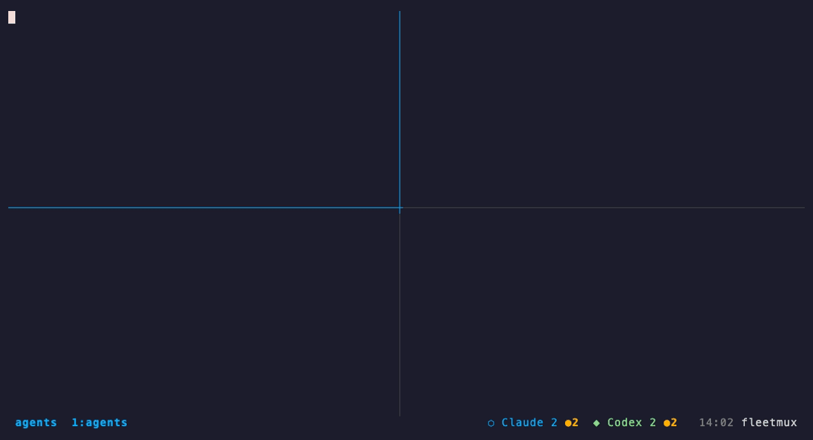

# fleetmux

**The agent-native tmux distribution.** A complete, opinionated tmux setup for developers
running AI coding agents. One command. Looks great out of the box. Status bar surfaces
agent pane states automatically.



*Four agents in one window. The bar reads `⬡ Claude 2 ●1  ◆ Codex 2 ●1` — one Claude pane is asking
for approval, one Codex pane is idle — and `Ctrl-q Enter` takes you to the next one that needs you.
Recorded against stand-in agent CLIs (`demo/`); detection and jumps are the real thing.*

---

## Install

```bash
bash <(curl -fsSL https://raw.githubusercontent.com/xiaolongnk/fleetmux/main/bin/install.sh)
```

Then:

```bash
fleetmux-start claude codex     # a session with both agents already running + a shell
fleetmux-doctor                 # did everything land? (run this on a new machine first)
```

Inside tmux, `prefix + I` installs the plugins once; `prefix + Tab` cycles through your agent panes
and `prefix + Enter` jumps to the next agent that is **waiting for you** (idle, or asking for approval).

**Requirements:** git (for TPM), curl. Nothing else — on macOS, if Homebrew itself
is missing, the installer bootstraps it for you (see below); tmux/starship/fish/
Ghostty are all installed through it. Debian/Ubuntu (`apt`) and Fedora (`dnf`)
use their native package manager instead — no Homebrew needed there.
WSL2: works — see [AGENTS.md](AGENTS.md#wsl2-notes) for pane-title caveats.
Windows native: not supported. Use WSL2.

**Homebrew bootstrap (macOS):** if `brew` isn't found, Step 0 runs Homebrew's own,
unmodified official installer (the same one at [brew.sh](https://brew.sh)) —
this may prompt for **your Mac password, in that terminal window**. fleetmux
never captures, scripts, or automates past that prompt; it's exactly the same
interactive install you'd get running Homebrew's installer yourself.

**Every component is detect-then-skip, never reinstalled without asking:**
tmux, Starship, and Fish are each checked against BOTH your `PATH` and their
common fixed install locations (not just `command -v`) before installing
anything — so a tmux from `apt`, a Starship from its own curl installer, or a
Fish you set up manually is correctly recognized as "already installed ✓" and
left alone, exactly like Ghostty's existing `/Applications/Ghostty.app` check.
Nothing is ever upgraded or reinstalled without an explicit re-run choosing to
do so. Running the installer twice in a row is a guaranteed no-op past the
first run — this is enforced by an automated CI test (`test/repeatability.sh`,
run.sh runs `install.sh` twice and diffs the resulting state + install-call
log) on every push.

---

**Just want the status bar in your own tmux config?** It's a TPM plugin on its own:
[`tmux-agent-status`](https://github.com/xiaolongnk/tmux-agent-status) — `set -g @plugin 'xiaolongnk/tmux-agent-status'`.

## What's included

| Component | What it does |
|-----------|-------------|
| `tmux/tmux.conf` | Full config: TPM, 4 plugins, agent-aware status bar, keybindings |
| `tmux/scripts/agent-status.sh` | Detects Claude Code / Codex / Cursor / Gemini panes by their running command and reads each pane's state from its screen; drives the status bar (`⬡ Claude 2 ●1  ◆ Codex 1` — amber ●N = panes waiting for you) |
| `tmux/scripts/agent-jump.sh` | `prefix + Tab/a/e/g` cycle through agent panes; `prefix + Enter` goes to the next one waiting for you |
| `bin/install.sh` | Idempotent installer: backs up config, installs TPM, Starship, Nerd Font, links config; `--with-fish` adds a fish preset + pins the pane shell |
| `bin/start` | `fleetmux-start claude codex` — a session with your agents already running, one window (or pane) each |
| `bin/doctor` | `fleetmux-doctor` — post-install health check that fails loudly on a partial setup |
| `fish/conf.d/fleetmux.fish` | Opt-in fish preset: no greeting, starship, agent CLIs on PATH, git abbreviations (`gst`, `gco`…) |
| `CHEATSHEET.md` | Full key-binding reference (also accessible via `prefix + ?`) |
| `AGENTS.md` | How pane-title detection works and how to customize it |

### Plugins (via TPM)

| Plugin | Purpose |
|--------|---------|
| `tmux-sensible` | Sane defaults: UTF-8, fast escape, 256color |
| `tmux-resurrect` | Save + restore sessions across reboots |
| `tmux-continuum` | Auto-save every 15 minutes; restore on startup |
| `tmux-yank` | Copy to system clipboard in copy mode |

---

## Key bindings (highlights)

| Key | Action |
|-----|--------|
| `prefix + \\` | Split pane vertically |
| `prefix + -` | Split pane horizontally |
| `prefix + h/j/k/l` | Navigate panes |
| `prefix + Enter` | Next agent pane that needs you (idle or awaiting approval) |
| `prefix + Tab` | Cycle through every agent pane |
| `prefix + a` / `e` / `g` | Cycle Claude / Codex / Gemini panes |
| `prefix + r` | Reload config |
| `prefix + ?` | Open cheat sheet |
| `prefix + I` | Install / update plugins |

See [CHEATSHEET.md](CHEATSHEET.md) for the full reference.

---

## What this is NOT

- **Not a session manager.** tmuxinator / tmuxifier fill that lane; they compose well with fleetmux.
- **Not a plugin manager.** We build on TPM, not replace it.
- **Not another pretty-config-only project.** Agent-aware status bar is the differentiation.
- **Not tied to Termio.** Genuinely useful standalone — the Termio mention is a footer, not a dependency.

---

## Configuration

Config lives at `~/.config/tmux/tmux.conf` (XDG-compliant); `~/.tmux.conf` is symlinked to it.

**Change prefix (default is Ctrl-q):**
Edit the three lines near the top of `~/.config/tmux/tmux.conf`:
```tmux
unbind C-q
set -g prefix C-a
bind C-a send-prefix
```
Then reload: `prefix + r`.

**Machine-local overrides** (own bindings, `default-shell`, …) go in `~/.config/tmux/local.conf` —
sourced by the managed config and never overwritten by an upgrade.

**Add a custom agent indicator:**
Edit `~/.config/tmux/scripts/agent-status.sh` — see [AGENTS.md](AGENTS.md).

**Fish on a fresh machine:** `--with-fish` installs fish, switches your login shell, drops a
preset into `~/.config/fish/conf.d/fleetmux.fish` (greeting off, starship, agent CLIs on PATH,
`gst`/`gco`/… abbreviations) and pins tmux's `default-shell` so every pane opens fish — even
if the tmux server started before `chsh` took effect.

---

## Upgrade

```bash
bash <(curl -fsSL https://raw.githubusercontent.com/xiaolongnk/fleetmux/main/bin/install.sh)
```

The installer backs up your existing config before replacing it.

---

## Uninstall

```bash
bash <(curl -fsSL https://raw.githubusercontent.com/xiaolongnk/fleetmux/main/bin/install.sh) --uninstall
```

Removes everything fleetmux wrote — the config it manages (detected via its own
`# fleetmux-managed` marker, so a config you wrote yourself at the same path is
never touched), TPM, `fleetmux-start`, and the init lines it appended to your
shell RC. It does **not** uninstall the tmux/starship/fish/ghostty *binaries*
(you may still want them for other things) and does not revert `chsh` — both
are printed as explicit one-line commands for you to run instead of guessed at
automatically. Timestamped `*.bak-*` backups from earlier installs are left in
place; the command prints how many it found.

---

## Troubleshooting

**My terminal looks frozen after scrolling with the mouse.** This is tmux's
own scrollback view ("copy mode") — expected behavior when `mouse on` is set,
not a hang. Press `q`, `Esc`, or `Ctrl-c` to get back to your shell; nothing
is lost.

### Developing

`test/README.md` describes the unit test for agent detection, the repeatability test the
CI runs on every push, and the Ghostty visual harness for eyeballing theme changes.

---

## License

MIT — see [LICENSE](LICENSE).

---

📱 **Running Claude Code agents in tmux?** Monitor them from your iPhone with
**[Termio](https://termio.xyz)** — the mobile companion for AI agent workflows.
Watch pane output, send messages, and get notified when agents need you — from anywhere.
